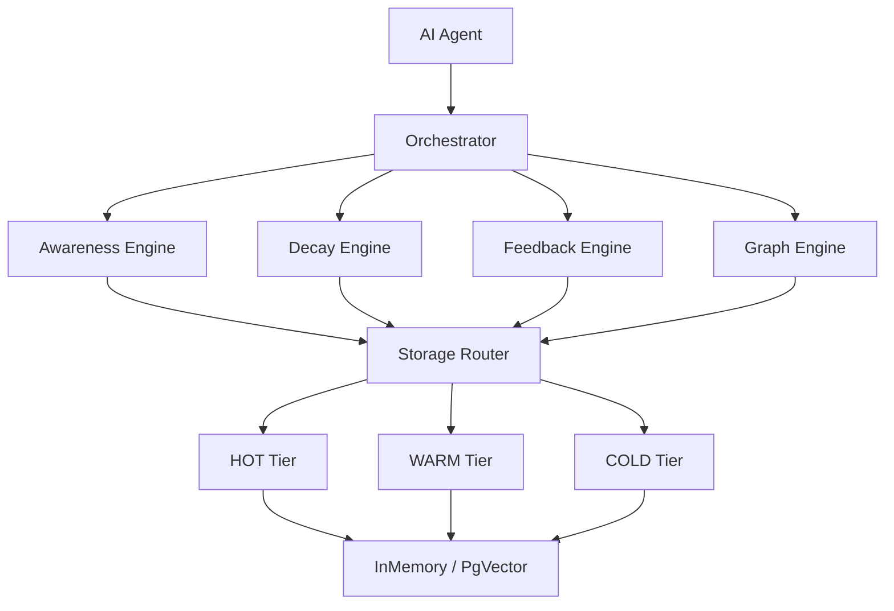

<p align="center">
  <span style="font-size: 80px;">🧠</span>
</p>

<h1 align="center">Memoria</h1>

<p align="center">
  <strong>Memory infrastructure for AI agents — storage-agnostic, self-evolving, observable.</strong><br>
  <em>Your agents stop forgetting.</em>
</p>

<p align="center">
  <a href="https://www.python.org/downloads/"></a>
  <a href="https://github.com/Oxygen56/memoria/blob/main/LICENSE"></a>
  <a href="https://github.com/Oxygen56/memoria/stargazers"></a>
  <a href="https://pypi.org/project/memoria-agent/"></a>
</p>

---

> *The memory layer every AI agent deserves — proactive recall, mathematical forgetting, zero vendor lock-in.*

---

## 🤔 Why Memoria?

AI agents today are **goldfish with GPUs**. Here's the problem:

- **Unlimited context growth** → token cost explosion, degraded performance
- **Existing solutions are basic CRUD** → no intelligence, just a glorified database
- **No forgetting mechanism** → stale memories pollute retrieval forever
- **Vendor lock-in** → tied to one vector DB or one cloud provider

**Memoria brings human-like memory to your agents:**

✅ Forget irrelevant things (mathematically, via Ebbinghaus curves)  
✅ Proactively recall important memories before you even ask  
✅ Detect contradictions and evolve knowledge over time  
✅ Plug into any storage backend — zero lock-in  

---

## 🚀 Quick Start

```python
from memoria import Memoria

# Default: InMemory storage, no external services required
async with Memoria() as mem:
    await mem.remember("User prefers dark mode", memory_type="preference")
    await mem.remember("Meeting with Alice at 3pm tomorrow", memory_type="event")
    
    context = await mem.recall("What does the user like?")
    # context.hot → ["User prefers dark mode"] (proactively injected)
```

That's it. Five lines to give your agent a brain.

---

## 📊 How Does Memoria Compare?

| Feature | Memoria | Mem0 | Letta | Zep |
|---------|---------|------|-------|-----|
| Ebbinghaus Decay | ✅ Mathematical model | ❌ | ❌ | ❌ |
| Proactive Recall | ✅ Awareness Engine | ❌ | ❌ | Limited |
| Knowledge Graph | ✅ Multi-hop traversal | ❌ | ❌ | ❌ |
| Contradiction Detection | ✅ Multi-provider | ❌ | ❌ | Limited |
| Storage Agnostic | ✅ InMemory + PgVector (extensible) | ❌ Qdrant only | ❌ Postgres | ❌ Cloud only |
| Deployment | Embedded SDK | Server required | Server required | SaaS |
| Fully Open Source | ✅ MIT | ✅ | ✅ | ❌ Core closed |

---

## 🏗️ Architecture



Four engines. One orchestrator. Pluggable storage. No magic.

---

## ✨ Key Features

### 🎯 Four-Engine Architecture
Awareness + Decay + Feedback + Graph — four specialized engines coordinated by a central Orchestrator. Each engine handles one cognitive responsibility, just like the human brain.

### 🌡️ Three-Tier Storage
**HOT → WARM → COLD → OBLIVION.** Memories automatically migrate through lifecycle tiers based on access frequency and decay scores. Hot memories are instant; cold ones are archived.

### 🏷️ 7 Memory Types
`FACT` · `PREFERENCE` · `EVENT` · `DECISION` · `RELATIONSHIP` · `SKILL` · `CONSTRAINT` — each with distinct decay characteristics and retrieval priorities.

### 📉 Ebbinghaus Forgetting Curve
Mathematical decay with type-specific half-lives:
- `FACT`: 180 days · `EVENT`: 90 days · `PREFERENCE`: 365 days
- Reinforcement on access (just like human memory)

### 🧲 Proactive Recall
The Awareness Engine injects relevant memories into context **before you ask**. No more "did I already tell the agent about this?"

### 🕸️ Knowledge Graph
Automatic entity/relation extraction from stored memories. Multi-hop BFS traversal connects dots your agent would otherwise miss.

### ⚡ Contradiction Detection
Three configurable providers: `LLM` (highest accuracy), `CrossEncoder` (balanced), `Heuristic` (fastest). Automatically flags and resolves conflicting memories.

### 🔌 Storage Adapters
Built-in: `InMemory`, `PgVector` — easily extensible. Need something else? Implement one interface and plug it in.

### 🔀 RRF Hybrid Search
Reciprocal Rank Fusion combining semantic similarity + keyword matching for retrieval that actually works in production.

---

## 📦 Installation

```bash
pip install memoria-agent  # PyPI release coming soon

# For now, install from source:
git clone https://github.com/Oxygen56/memoria.git
cd memoria
pip install -e .
```

---

## ⚙️ Configuration

```python
from memoria.core.config import MemoriaConfig, StorageBackendConfig, DecayConfig

config = MemoriaConfig(
    # Storage backend ("memory" or "pgvector")
    warm_backend=StorageBackendConfig(type="memory"),
    
    # Decay parameters
    decay=DecayConfig(
        decay_cycle_interval_hours=6,
        warm_to_cold_threshold=0.3,
        cold_to_oblivion_threshold=0.05,
    ),
)
```

Every parameter has a sensible default. Override only what you need.

---

## 🔗 Integrations

- **Any LLM framework** — works with LangChain, CrewAI, OpenAI Agents SDK, or raw API calls

---

## 💻 CLI

```bash
memoria remember "User prefers dark mode" --type preference
memoria recall "user preferences"
memoria stats
```

---

## 🗺️ Roadmap

- [ ] PyPI package release
- [ ] MCP server integration
- [ ] REST API — standalone server mode for language-agnostic access
- [ ] Dashboard UI for memory visualization
- [ ] Multi-agent shared memory
- [ ] Benchmarks against Mem0 / Letta / Zep
- [ ] LangChain native integration
- [ ] Async batch operations

---

## 🤝 Contributing

Contributions are welcome! Whether it's a bug fix, new storage adapter, or feature idea:

1. Fork the repo
2. Create your feature branch (`git checkout -b feat/amazing-feature`)
3. Commit your changes (`git commit -m 'Add amazing feature'`)
4. Push to the branch (`git push origin feat/amazing-feature`)
5. Open a Pull Request

Check out [open issues](https://github.com/Oxygen56/memoria/issues) for ideas on where to start.

---

## 📄 License

MIT © [Oxygen56](https://github.com/Oxygen56)

See [LICENSE](./LICENSE) for details.

---

## ⭐ Star History

[](https://star-history.com/#Oxygen56/memoria&Date)

---

<p align="center">
  <strong>If your agent forgets, it's not intelligent — it's just expensive.</strong><br>
  <a href="https://github.com/Oxygen56/memoria">Give Memoria a ⭐</a> and stop paying for amnesia.
</p>
